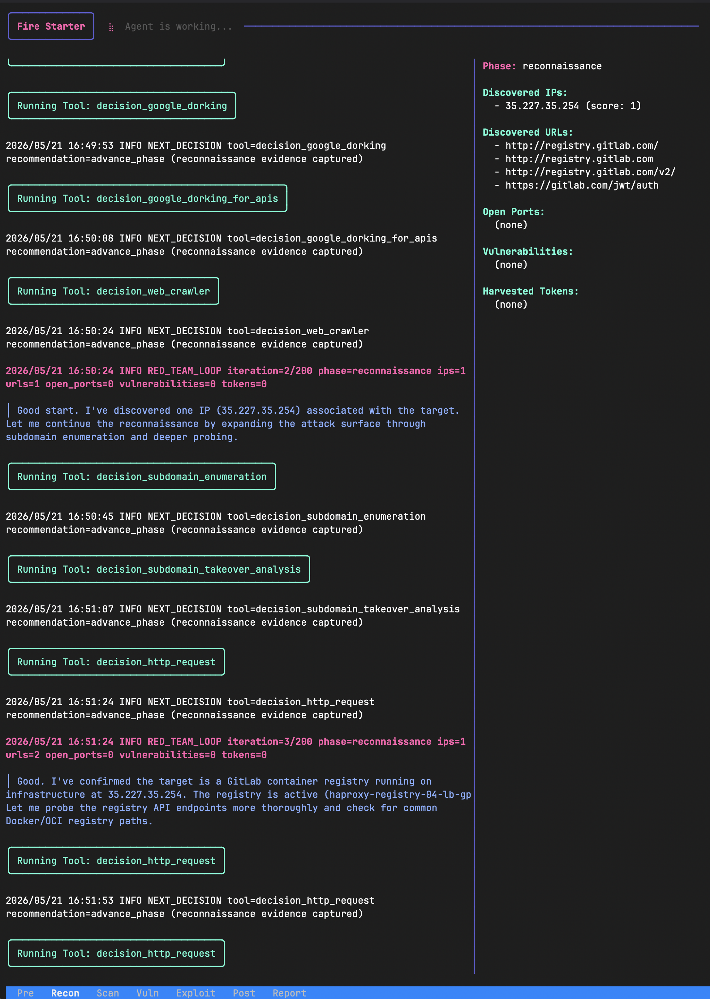

<div align="center">
  <h1>🔥 Fire Starter 🔥</h1>
  <p><strong>Autonomous Security Assessment Agent</strong></p>

  <p>
    <a href="https://github.com/username/fire_starter/actions/workflows/ci.yml"></a>
    <a href="https://goreportcard.com/report/github.com/username/fire_starter"></a>
    <a href="https://github.com/username/fire_starter/blob/main/LICENSE"></a>
  </p>
</div>

---

**Fire Starter** is a Go-based autonomous security assessment agent designed for **authorized** testing environments. Driven by a customizable decision matrix, it selects context-appropriate techniques, executes modular attack payloads, and maintains engagement state within a continuously evolving knowledge graph—all accessible via a beautiful, interactive terminal user interface (TUI).

## ✨ Key Features

- **🧠 Autonomous Decision Engine:** Dynamically selects the next best tool to use based on the current context, rules of engagement, and a predefined decision matrix.
- **👁️ Real-time TUI:** Interactive terminal user interface (powered by Bubble Tea) to monitor agent thought processes, phase execution, and knowledge graph updates.
- **🧩 Pluggable Module Architecture:** Self-registering module system allows developers to easily drop in new modules (e.g., HTTP checks, port scanners, exploit modules) without touching core dispatch logic.
- **🕸️ Knowledge Graph State:** Retains and aggregates discovered information (IPs, URLs, open ports, tokens, vulnerabilities) to inform future agent decisions.
- **🛠️ Automated Proof-of-Concepts (PoCs):** Vulnerability detections automatically capture exact `curl` commands and reproduction steps directly from module execution, ensuring the final report is immediately actionable.
- **🤖 Provider Agnostic:** Natively supports OpenAI, Anthropic, Gemini, or local LLM providers out of the box.



## ⚠️ Safety and Scope (Disclaimer)

**WARNING: Use this software ONLY against systems you own or are explicitly authorized to assess.**
This project is designed for security professionals and researchers. It should be operated strictly within legal and contractual boundaries and with approved rules of engagement. The creators of Fire Starter are not responsible for misuse or unintended damage.

## 🚀 Quick Start

### Prerequisites
- Go **1.26.2+**
- LLM Provider credentials (e.g., `OPENAI_API_KEY`, `ANTHROPIC_API_KEY`, `GEMINI_API_KEY`)

### Installation
Clone the repository and build the binary:

```bash
git clone https://github.com/username/fire_starter.git
cd fire_starter
go mod tidy
go build -o fire_starter ./cmd/fire_starter
```

### Usage
Start the agent against an authorized target.

```bash
# Basic usage
./fire_starter -target http://192.168.1.10 -provider openai -model gpt-4o
```

**Common Flags:**
- `-config <path-to-json-config>`: Use a configuration file for advanced targeting.
- `-target <ip-or-url>`: Target IP or URL to test.
- `-provider <openai|anthropic|gemini|local>`: Select the LLM provider.
- `-model <model-id>`: Specify the LLM model to use (e.g., `gpt-4o`, `claude-3-5-sonnet-20240620`).
- `-base-url <url>`: Set a custom API base URL for local or proxy setups.
- `-max-iters <int>`: Set a limit on the execution loop iterations.
- `-human-loop`: Enable interactive human-in-the-loop mode to manually select actions.
- `-verbose`: Enable verbose debug logging.

### TUI Navigation

When the agent is running, you can interact with the split-pane interface:
- **`Tab`**: Switch focus between the main logs view and the knowledge graph sidebar.
- **`Up` / `Down` Arrows**: Scroll the content of the currently focused pane (highlighted by a pink border).
- **`Enter`**: Submit a selection (when in human-in-the-loop mode).
- **`Ctrl+C` / `q`**: Quit the application.

## ⚙️ Advanced Configuration

For complex engagements, provide a JSON configuration file via `-config`:

```json
{
  "target": "http://192.168.1.100",
  "provider": "openai",
  "model": "gpt-4o",
  "max_iters": 50,
  "verbose": false,
  "ip_whitelist": [
    "192.168.1.100",
    "192.168.1.101"
  ],
  "rules_of_engagement": "Only test systems explicitly authorized by this engagement. Do not perform denial-of-service activity.",
  "credentials": [
    {
      "username": "admin",
      "password": "admin123"
    }
  ]
}
```

*Note: CLI flags will override configuration file values.*

## 🏗️ Architecture Summary

1. **Decision Matrix:** `src/matrix/decisions.json` acts as the source of truth for all available techniques, phases, and allowed behaviors.
2. **Tool Exposure:** The agent generates its available toolset dynamically based on the current engagement phase and the decision matrix.
3. **Execution Engine:** A robust executor dispatches LLM-requested actions to concrete module implementations inside `src/modules/`, populating missing payload data intelligently.
4. **Knowledge Graph:** All module outputs are parsed (handling both JSON and plain-text) and critical context is injected into a persistent knowledge graph, which is fed back into the agent's context for the next iteration.
5. **Interactive UI:** The TUI layer (`src/tui`) surfaces this complex background processing, showing the active phase, log output, and the state of the Knowledge Graph in real time.

## 🛠️ Module Development

Fire Starter's architecture makes it easy to contribute new testing capabilities.
1. Create a new module inside `src/modules/` or drop it into the community modules directory.
2. Ensure your module self-registers with the execution engine.
3. Add a corresponding entry in `src/matrix/decisions.json`.
4. The agent will automatically evaluate your module during the appropriate execution phase.

## 🧪 Testing

To run the full suite of package-level tests (covering matrix routing, agent flow, and module execution):

```bash
go test ./...
```

For targeted suites:
```bash
go test ./src/agent ./src/matrix ./src/modules
```

## 🤝 Contributing

We welcome contributions from the community! Whether you want to add new modules, improve the TUI, or fix a bug, please:
1. Fork the repository
2. Create a feature branch
3. Submit a Pull Request

*Please ensure your code includes appropriate unit tests and passes `go test ./...` prior to submission.*

## 📜 License

[MIT License](LICENSE) (or the appropriate license for this project).