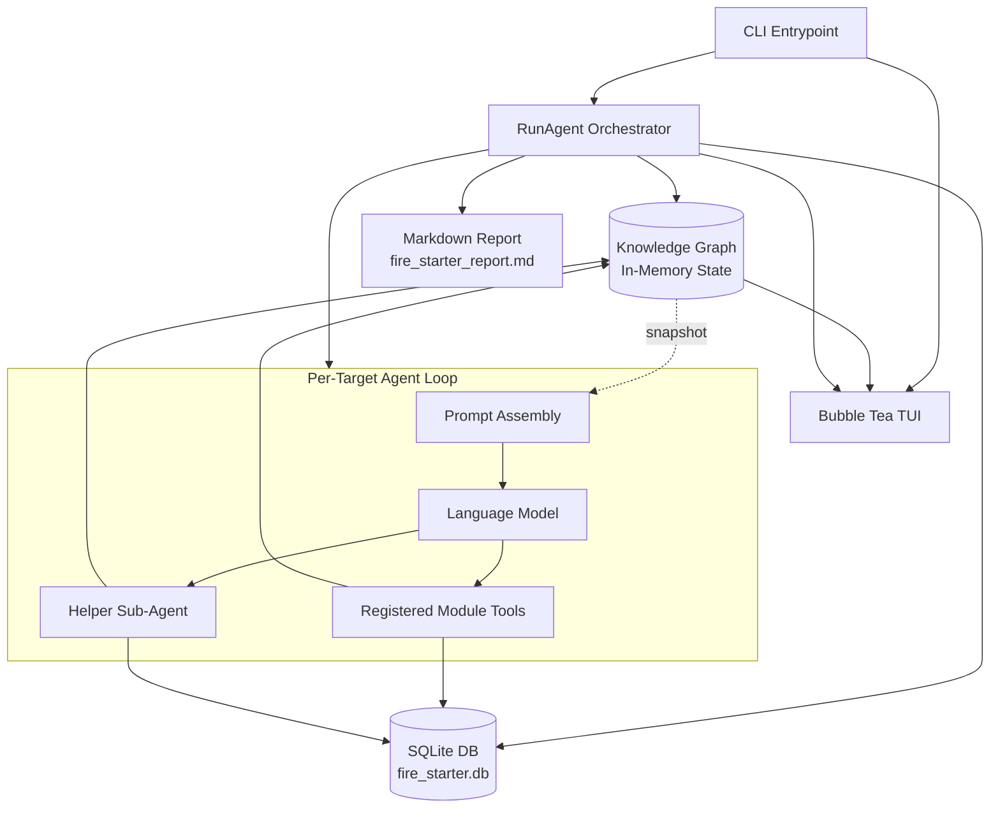

# Agent Data Flow and Architecture

Fire Starter uses a CLI-first orchestration model centered around a shared knowledge graph plus SQLite-backed persistence. The entrypoint in `cmd/fire_starter/main.go` launches the Bubble Tea interface, initializes the agent workflow, and streams execution state into the UI while the orchestration layer evaluates targets.

## High-level data flow

## 1. Entrypoint and config loading

`cmd/fire_starter/main.go` performs the startup sequence:

- creates the default config
- loads a JSON config file when `-config` is provided
- applies CLI flag overrides
- validates that a target exists
- starts the Bubble Tea program
- launches `agent.RunAgent(...)` in a goroutine

The current user-facing flags are:

- `-config`
- `-target`
- `-provider`
- `-model`
- `-base-url`
- `-max-iters`
- `-verbose`
- `-efficiency`

## 2. Orchestration layer

`src/agent/workflow.go` is the control plane.

It is responsible for:

- provider initialization for OpenAI, Anthropic, Gemini, and local OpenAI-compatible endpoints
- target normalization and scope enforcement
- loading and scoring tools from the decision matrix
- driving per-target execution phases
- persisting vulnerabilities and execution logs
- generating the final markdown report

Efficiency mode is enabled by default. When left on, the target agent is allowed to aggressively skip low-value targets early.

## 3. Tool exposure and execution

`src/matrix/tool_registry.go` converts decision definitions into model-callable tools.

`src/matrix/real_executor.go` then:

- resolves a tool back to its technique
- normalizes payload fields such as `ip` and `url`
- looks up a registered module factory in `src/modules/core`
- executes the module
- attaches proof-of-concept evidence captured via `BaseModule.RecordPoC(...)`

## 4. Knowledge graph and persistence

`src/matrix/knowledge_graph.go` tracks the evolving engagement state, including:

- discovered targets
- open ports
- credentials and tokens
- vulnerability summaries
- target phase transitions

`src/matrix/db.go` persists execution logs and vulnerability records to `fire_starter.db`.

This split keeps fast iteration state in memory while still retaining durable evidence on disk.

## 5. Helper sub-agent flow

During deeper validation, the target loop can spawn a focused helper sub-agent for a specific finding. That helper gets the target, finding summary, available tools, and current graph context so it can refine exploitability evidence and update the persistent vulnerability record.

## 6. Report generation

At the end of a run, the workflow:

1. reads persisted vulnerabilities
2. asks the configured model for a narrative report when possible
3. falls back to a minimal markdown report if report generation fails
4. appends a JSON knowledge graph dump
5. writes the result to `fire_starter_report.md`

## 7. TUI data flow

The TUI in `src/tui` receives two message streams:

- execution logs written through the program writer
- knowledge graph updates serialized to JSON

The UI shows a live log pane plus a target-oriented knowledge graph browser with an inspector mode for individual targets.
